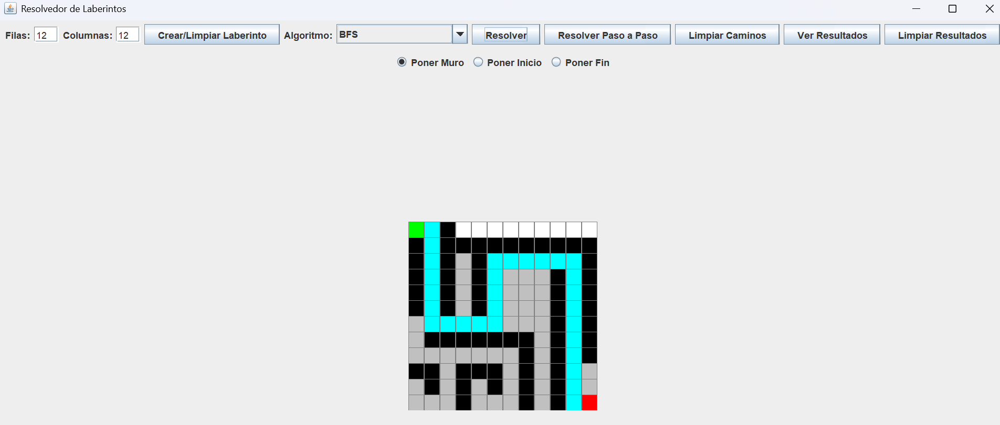
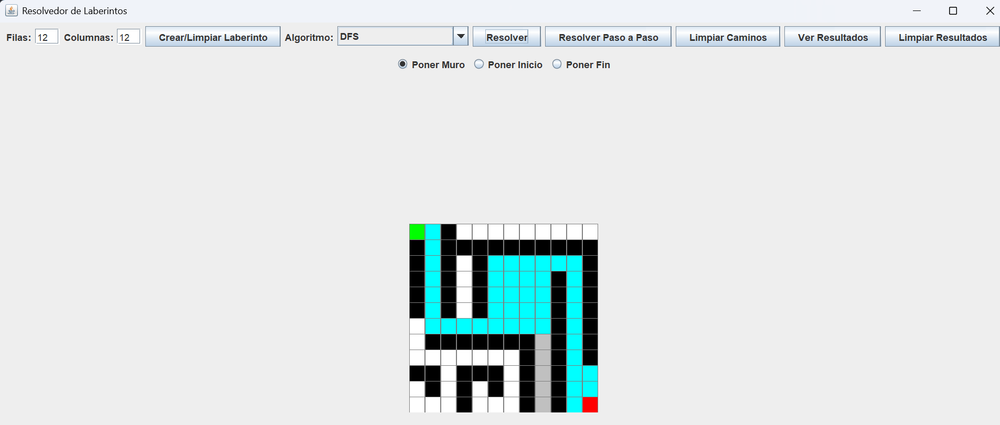
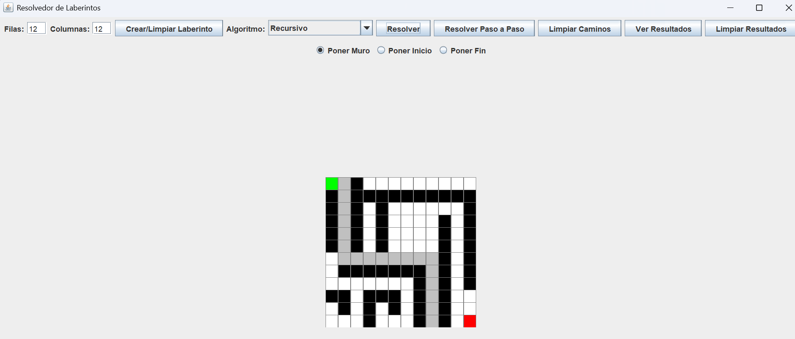
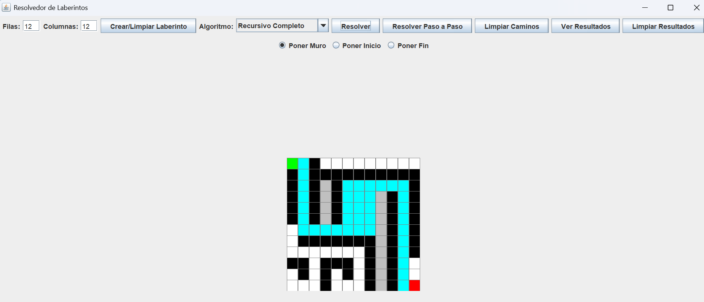
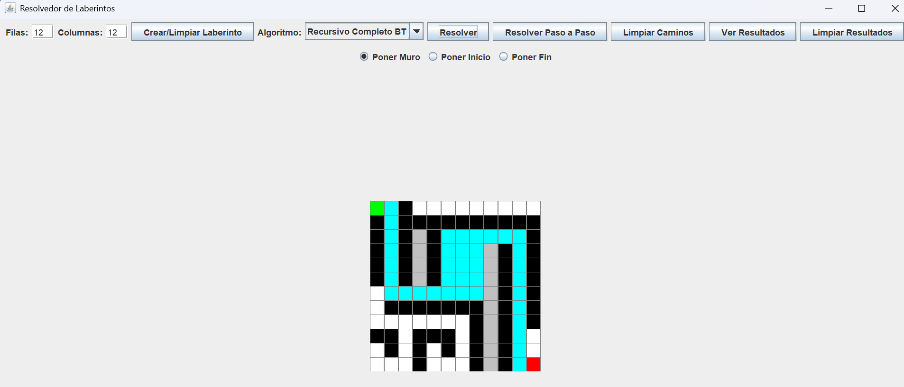
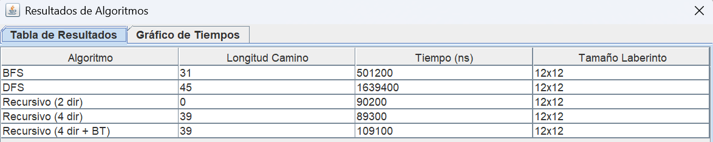
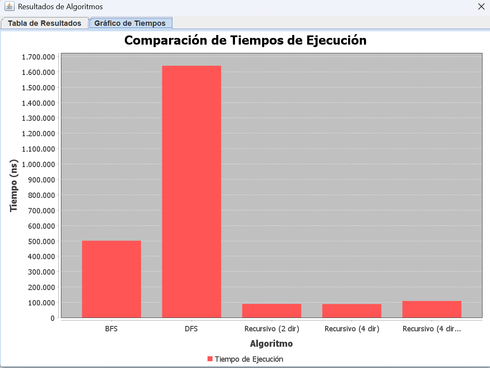

# Proyecto Final - Estructura de Datos

**Título de la Práctica:** Implementación de un Algoritmo para Encontrar la Ruta Óptima en un Laberinto Aplicando Programación Dinámica y Estructuras de Datos  
**Carrera:** Computación  
**Asignatura:** Estructura de Datos – Segundo Interciclo  

---

## Objetivo

Desarrollar una aplicación que implemente algoritmos para encontrar la ruta óptima desde un punto de inicio (A) hasta un punto de destino (B) en un laberinto. Para ello, se utilizan conceptos de estructuras de datos lineales y no lineales, patrones de diseño (MVC), y se comparan tiempos/eficiencia entre diversos enfoques de búsqueda.

---

## Universidad Politécnica Salesiana


- Universidad: Universidad Politécnica Salesiana  
- Carrera: Ingeniería en Ciencias de la Computación  
- Asignatura: Estructura de Datos  
- Estudiantes: Byron Xavier Ortega Delgado (bortgead@est.ups.edu.ec)  
                Dave Fernado Siguencia Vallejo(dsiguenzav@est.ups.edu.ec)
- Docente: Ing. Pablo Torres  

---

## Descripción del Problema

El proyecto consiste en resolver un laberinto representado como una matriz de celdas, donde cada celda puede ser transitable, muro, inicio o destino. El reto es encontrar el camino óptimo desde el punto A (inicio) hasta el punto B (fin), utilizando algoritmos de búsqueda y estructuras de datos eficientes. Además, el proyecto incluye una interfaz gráfica interactiva para configurar el laberinto y visualizar el proceso de resolución.

---

### Descripción de la Solución

La aplicación permite al usuario:
- Definir tamaño del laberinto.
- Seleccionar celdas como inicio, fin o muros.
- Elegir entre los algoritmos BFS, DFS o variantes recursivas para encontrar la solución.
- Visualizar la ruta encontrada y estadísticas de tiempo de ejecución y longitud del camino.
- Guardar los resultados para análisis posterior.

## Estructura del Proyecto

El proyecto sigue el patrón de diseño MVC (Modelo-Vista-Controlador), con la siguiente estructura:

### 1. **Controladores (controllers)**
- **MazeController.java:** Coordina la interacción entre la interfaz gráfica, los algoritmos de búsqueda y el almacenamiento de resultados.

### 2. **Acceso a Datos (dao y daoImpl)**
- **AlgorithmResultDAO.java:** Define la interfaz para el manejo de resultados.
- **AlgorithmResultDAOFile.java:** Implementación que guarda y carga resultados desde `results.csv`.

### 3. **Modelos (models)**
- **AlgorithmResult.java:** Representa el resultado de un algoritmo (tiempo, pasos).
- **Cell.java:** Define las propiedades de una celda.
- **CellState.java:** Enum que define los estados de las celdas (EMPTY, WALL, START, END, VISITED, PATH).
- **SolveResults.java:** Contiene la información de la solución del laberinto.

### 4. **Algoritmos (solver y solverImpl)**
- **MazeSolver.java:** Interfaz base para todos los algoritmos.
- **MazeSolverBFS.java:** Implementación de Breadth-First Search.
- **MazeSolverDFS.java:** Implementación de Depth-First Search.
- **MazeSolverRecursivo.java:** Algoritmo recursivo simple.
- **MazeSolverRecursivoCompleto.java y MazeSolverRecursivoCompletoBT.java:** Variantes recursivas con backtracking.

### 5. **Vistas (views)**
- **MazeFrame.java:** Ventana principal que muestra el editor de laberintos y los controles.
- **MazePanel.java:** Renderiza gráficamente el laberinto.
- **ResultadosDialog.java:** Muestra los resultados históricos y puede visualizar estadísticas.

### 6. **Clase Principal**
- **MazeApp.java:** Contiene el método `main()` para iniciar la aplicación.

### 7. **Recursos Adicionales**
- **lib/:** Contiene las dependencias externas `jfreechart-1.5.6.jar` y `jcommon-1.0.24.jar` para la generación de gráficos.
- **results.csv:** Registro de resultados de ejecuciones previas.
- **README.md:** Documentación básica del proyecto.

## Diagrama UML

@startuml
' --- Estilos y Configuración ---
skinparam classAttributeIconSize 0
skinparam packageStyle rect
hide empty members

' --- Enumeraciones y Modelos Simples ---
package "models" {
  class Cell {
    - int row
    - int col
    - CellState state
  }

  enum CellState {
    WALL
    PATH
    START
    END
    VISITED
    SOLUTION
  }

  class AlgorithmResult {
    - String algorithmName
    - long executionTime
    - int pathLength
    - int nodesVisited
  }

  class SolveResults {
    + List<AlgorithmResult> results
  }
}

' --- Interfaces (Contratos) ---
package "dao" {
  interface AlgorithmResultDAO <<interface>> {
    + void save(AlgorithmResult result)
    + List<AlgorithmResult> getAll()
  }
}

package "solver" {
  interface MazeSolver <<interface>> {
    + SolveResults solve(Cell[][] maze)
  }
}

' --- Implementaciones Concretas ---
package "dao.daoImpl" {
  class AlgorithmResultDAOFile implements AlgorithmResultDAO {
    - String filePath
    + void save(AlgorithmResult result)
    + List<AlgorithmResult> getAll()
  }
}

package "solver.solverImpl" {
  class MazeSolverBFS implements MazeSolver
  class MazeSolverDFS implements MazeSolver
  class MazeSolverRecursivo implements MazeSolver
  class MazeSolverRecursivoCompleto implements MazeSolver
  class MazeSolverRecursivoCompletoBT implements MazeSolver
}

' --- Vista (UI) ---
package "views" {
  class MazeFrame {
    - MazePanel mazePanel
    - MazeController controller
  }

  class MazePanel {
    - Cell[][] mazeData
    + void paintComponent(Graphics g)
  }

  class ResultadosDialog {
    + void displayResults(SolveResults results)
  }
}

' --- Controlador ---
package "controllers" {
  class MazeController {
    - MazeFrame view
    - MazeSolver solver
    - AlgorithmResultDAO resultDAO
    + void solveMaze()
    + void saveResults()
  }
}

' --- Punto de Entrada ---
class MazeApp {
  + {static} void main(String[] args)
}

' --- Relaciones ---

' App -> Controller -> View
MazeApp ..> MazeController : "crea"
MazeController -> MazeFrame : "controla"
MazeFrame ..> MazeController : "notifica eventos"

' Controller -> Model & Solver & DAO
MazeController o--> MazeSolver : "usa"
MazeController o--> AlgorithmResultDAO : "usa"
MazeController ..> SolveResults : "obtiene"
MazeController ..> AlgorithmResult : "crea"


' View -> Model
MazeFrame *-- MazePanel
MazeFrame ..> ResultadosDialog : "crea y muestra"
MazePanel --> Cell : "dibuja"
ResultadosDialog ..> SolveResults : "muestra"

' DAO y sus relaciones
AlgorithmResultDAOFile ..> AlgorithmResult : "persiste"

' Agregación de resultados
SolveResults o-- "1..*" AlgorithmResult

' Relación entre celdas y sus estados
Cell *-- CellState

' Implementaciones de Solver
MazeSolver <|.. MazeSolverBFS
MazeSolver <|.. MazeSolverDFS
MazeSolver <|.. MazeSolverRecursivo
MazeSolver <|.. MazeSolverRecursivoCompleto
MazeSolver <|.. MazeSolverRecursivoCompletoBT

' Los solvers operan sobre celdas
MazeSolver ..> Cell : "opera sobre"

@enduml


## Marco Teórico

Para encontrar rutas óptimas en laberintos representados como grafos, se utilizan diversos algoritmos de búsqueda y estructuras de datos:

- **Programación Dinámica:** Técnica de optimización que evita cálculos repetitivos, guardando soluciones de subproblemas.
- **BFS (Breadth-First Search):** Algoritmo de búsqueda en anchura que garantiza encontrar el camino más corto en grafos no ponderados, usando colas.
- **DFS (Depth-First Search):** Algoritmo que explora profundamente antes de retroceder, útil para exploraciones completas.
- **Búsqueda Recursiva:** Variante de DFS utilizando llamadas recursivas en lugar de estructuras explícitas.
- **Backtracking:** Exploración de todas las rutas posibles, retrocediendo al encontrar callejones sin salida.

Se utilizan estructuras como matrices, listas, colas, pilas, mapas y conjuntos para la implementación eficiente de estas técnicas.

---

## Implementación del Proyecto

### Arquitectura MVC

- **Modelo:** `Cell`, `CellState`, `SolveResults`, `AlgorithmResult`
- **Vista:** `MazeFrame`, `MazePanel`, `ResultadosDialog`
- **Controlador:** `MazeController`

### Algoritmos Implementados

- BFS (Anchura)
- DFS (Profundidad)
- Recursivo Simple
- Recursivo Completo
- Recursivo con Backtracking

### Estructuras de Datos Utilizadas

- Matriz bidimensional (`Cell[][]`)
- Listas (`ArrayList`)
- Pilas y colas (`LinkedList`)
- Conjuntos (`HashSet`)
- DAO sobre archivo CSV

### Herramientas Utilizadas

- Java
- Swing (GUI)
- Patrón MVC
- JFreeChart (visualización gráfica opcional)
- VSCode (entorno)
- CSV para almacenamiento de resultados

---

## Interfaz de Usuario

- Permite seleccionar el tamaño del laberinto
- Marcar muros, punto de inicio y fin
- Seleccionar algoritmo a usar
- Visualizar resultados de la ejecución
- Mostrar historial de resultados

---

## Comparación de Algoritmos

| Algoritmo              | Tiempo (ms) | Longitud Ruta | Celdas Visitadas |
|------------------------|-------------|----------------|-------------------|
| BFS                   | 2           | 38             | 92                |
| DFS                   | 4           | 57             | 211               |
| Recursivo             | 5           | 57             | 207               |
| Recursivo Completo    | 12          | 38             | 523               |
| Recursivo Completo BT | 9           | 38             | 330               |

*Los datos son ilustrativos. Los resultados reales pueden variar.*

---

## Resultados y Visualización

- Los resultados se guardan en `results.csv`
- Se visualizan en `ResultadosDialog`
- Opcionalmente se pueden integrar gráficos con JFreeChart para comparar algoritmos

---

## Capturas de Pantalla

- **Interfaz Principal:**  


- **Colacamos Incion-Fin y Colacamos Obstaculos:**


- **Visualización BFS:** 



- **Visualización DFS:** 



- **Visualización Reculsivo:** 



- **Visualización Reculsivo Completo:** 



- **Visualización Reculsivo Completo BT:**



- **Visualización Tabla De Resultados:**



- **Visualización Grafica De Resultados:** 




## Conclusiones

- BFS es ideal para encontrar caminos más cortos en laberintos no ponderados.
- DFS y soluciones recursivas son útiles pero no siempre óptimas.
- El patrón MVC facilitó la organización del código y su mantenimiento.
- La integración de métricas permitió analizar el rendimiento de cada algoritmo.

---

## Conclusión Byron Xavier Ortega Delagado:

## El Algoritmo Más Óptimo es BFS

El análisis de los algoritmos de búsqueda para resolver laberintos revela que el BFS (Breadth-First Search) es la opción más óptima si el objetivo es encontrar la ruta más corta posible. Su principal fortaleza radica en la forma en que explora el laberinto.

## ¿Por qué BFS es el más óptimo?
Garantiza la ruta más corta: BFS explora todas las celdas en "capas" concéntricas desde el punto de inicio. Esto significa que visita todas las celdas a distancia 1, luego a distancia 2, y así sucesivamente. Cuando finalmente llega a la celda de destino, se asegura de que esta es la primera vez que se alcanza, lo que significa que el camino que encontró es el más corto en términos de número de pasos. Los otros algoritmos, como DFS, no pueden garantizar esto porque su búsqueda profunda podría desviarse por un camino largo antes de encontrar la salida.

Complejidad y eficiencia: Aunque en términos de tiempo de ejecución (medido en milisegundos), a veces un algoritmo como DFS puede ser más rápido si la salida está en un camino recto, la eficiencia de BFS es más predecible. Su complejidad de tiempo es O(V+E), donde V es el número de vértices (celdas) y E es el número de aristas (caminos entre celdas), lo que es muy eficiente.

En resumen, si la meta es siempre encontrar el camino más corto, BFS es la mejor elección. Para propósitos educativos y de demostración, los otros algoritmos son valiosos, pero en aplicaciones prácticas de búsqueda del camino más corto, BFS sobresale.

## Conclusión Dave Fernado Siguencia Vallejo:

## El Algoritmo Más Óptimo es BFS

Si bien BFS es inmejorable para encontrar la ruta más corta en un laberinto, es importante considerar que la "optimización" de un algoritmo a menudo depende del objetivo específico de la aplicación. En escenarios donde el tiempo de ejecución es el factor más crítico y el laberinto es de una complejidad tal que puede explorarse rápidamente, o si simplemente se busca cualquier camino hacia la salida, otros algoritmos pueden ser igualmente válidos o incluso preferibles.

Por ejemplo, el DFS (Depth-First Search), aunque no garantiza la ruta más corta, puede ser extraordinariamente eficiente en términos de uso de memoria, especialmente en laberintos muy grandes o con estructuras lineales. Esto se debe a su naturaleza de "búsqueda profunda", que explora un camino hasta el final antes de retroceder, lo que significa que solo necesita almacenar el camino actual, en contraste con BFS, que debe mantener un registro de todas las celdas en la "capa" actual y las siguientes. En situaciones donde los recursos de memoria son limitados o el laberinto tiene una estructura que favorece una exploración profunda (como un pasillo largo y directo hacia la salida), DFS podría ofrecer una solución lo suficientemente rápida sin la sobrecarga de memoria de BFS.

## Recomendaciones

- Incluir algoritmos heurísticos como A* o Dijkstra.
- Incorporar obstáculos dinámicos.
- Agregar pruebas automatizadas.
- Mejorar la interfaz y compatibilidad multiplataforma.
- Usar bases de datos o archivos JSON para persistencia.

---

## Cómo Ejecutar

1. Compilar el proyecto con:

```
javac -d bin -cp "lib/*" src/**/*.java
```

2. Ejecutar la aplicación:

```
java -cp "bin:lib/*" MazeApp
```

En Windows usar `;` en lugar de `:` en el classpath.

---

## Versión

- Versión: 1.0.0  
- Descripción: Proyecto Final – Estructura de Datos

